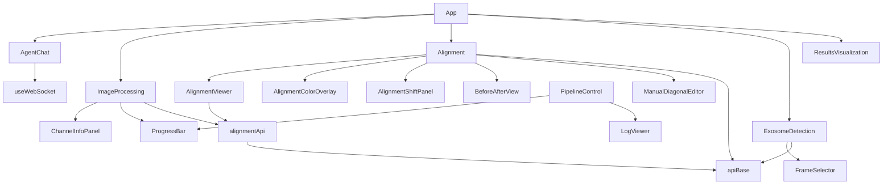
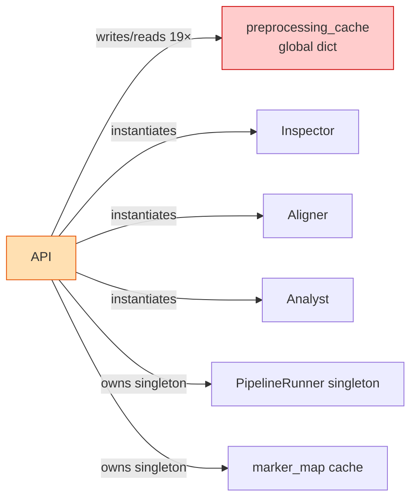

# SEA Exosome Analysis Tool — Architecture

> Read-only documentation. Last updated 2026-04-28.
> Do not modify code based on this file without separate review.

---

## Table of Contents

1. [System Overview](#1-system-overview)
2. [Directory Map](#2-directory-map)
3. [Module Responsibilities](#3-module-responsibilities)
4. [Data Flow](#4-data-flow)
5. [Dependency Graph](#5-dependency-graph)
6. [API Surface](#6-api-surface)
7. [Key Data Structures](#7-key-data-structures)
8. [State Management](#8-state-management)
9. [Pain Points](#9-pain-points)
10. [Impact Map — Where to Touch for Common Changes](#10-impact-map)

---

## 1. System Overview

SEA is a desktop/server application for multi-channel fluorescence microscopy analysis. The workflow is:

1. **Load** raw per-channel TIFF stacks from disk.
2. **Preprocess** each channel interactively (contrast, histogram equalization).
3. **Align** channels to a reference (affine/TPS registration via Kornia/LoFTR).
4. **Detect** exosomes on each aligned channel (StarDist, Blob, SAM, Random Forest).
5. **Colocalize** detections across channels (distance-based + Union-Find combos).
6. **Export** detections and colocalization statistics to CSV/JSON.

There is also an LLM-assisted QA path (GPT-4o visual checks at the alignment and statistical analysis steps) and a batch pipeline runner that chains phases 1–3 automatically.

```
┌──────────────────────────────────────────────────────────────┐
│  Electron shell (main.js / preload.js)                       │
│  ┌───────────────────────────────────────────────────────┐   │
│  │  React UI  (Vite + TypeScript)                        │   │
│  │  Five tabs: AgentChat | ImageProcessing | Alignment   │   │
│  │             ExosomeDetection | Results                │   │
│  └───────────────────────┬───────────────────────────────┘   │
│                          │ HTTP + WebSocket                   │
│  ┌───────────────────────▼───────────────────────────────┐   │
│  │  Flask API  (api_server_extended.py, port 5000)       │   │
│  │  33 routes + 1 WebSocket endpoint                     │   │
│  │                                                       │   │
│  │  ┌──────────┐  ┌──────────┐  ┌──────────┐            │   │
│  │  │Inspector │  │ Aligner  │  │ Analyst  │            │   │
│  │  │(Phase 1) │  │(Phase 2) │  │(Phase 3) │            │   │
│  │  └──────────┘  └──────────┘  └──────────┘            │   │
│  │        └───────────┴───────────┘                     │   │
│  │             PipelineRunner (batch)                    │   │
│  │                                                       │   │
│  │  ExosomeDetection  ←  blob / SAM / RF / StarDist      │   │
│  └───────────────────────────────────────────────────────┘   │
│                          │ tifffile / pandas / numpy          │
│  ┌───────────────────────▼───────────────────────────────┐   │
│  │  data/  (input TIFFs, processing TIFFs, CSV outputs)  │   │
│  └───────────────────────────────────────────────────────┘   │
└──────────────────────────────────────────────────────────────┘
```

**Runtime environments:**
- **Dev**: `vite dev` (port 5173) + `python api_server_extended.py` (port 5000)
- **Production**: Electron AppImage bundles both; `main.js` spawns the Python subprocess

---

## 2. Directory Map

```
SEA/
│
├── api_server_extended.py   ★ 4 040 lines — entire backend in one file
├── api_server.py              354 lines — legacy/reference (not actively used)
├── api_agent_chat.py        1 557 lines — separate LLM chat server (port 5001)
├── pipeline.py                331 lines — thin CLI entry point for batch runs
│
├── agents/                  ── Three-phase ML pipeline agents
│   ├── base_agent.py          127 — Abstract base (load_image, ensure_float32)
│   ├── inspector.py           400 — Phase 1: QA, SNR, sharpness, optional denoise
│   ├── aligner.py             966 — Phase 2: feature matching, affine/TPS registration
│   └── analyst.py             828 — Phase 3: StarDist detection + colocalization
│
├── core/                    ── Pipeline orchestration + session state
│   ├── pipeline_runner.py     528 — Threaded runner, progress callbacks
│   ├── preprocess_session.py  189 — File-backed session state (JSON + JSONL log)
│   ├── preprocess/
│   │   ├── preprocess_engine.py   244 — Per-channel contrast/histogram logic
│   │   └── preprocess_runner.py   265 — Batch preprocessing coordinator
│   └── manifest/
│       ├── manifest.py        399 — Run-level manifest (tracks agent outputs)
│       └── schema.py          202 — Pydantic/dataclass schemas for manifest
│
├── exosome_detection/       ── Pluggable detection backends
│   ├── blob_service.py        214 — Laplacian-of-Gaussian blob detection
│   ├── sam_service.py         389 — SAM (Segment Anything) wrapper
│   ├── random_forest_segmentation.py  344 — Interactive RF classifier
│   ├── object_classifier.py   270 — Post-detection object keep/discard
│   └── spatial_analysis.py    251 — Proximity-based colocalization metrics
│
├── utils/
│   ├── config_loader.py        45 — Loads config/config.yaml
│   └── image_utils.py         143 — Shared image helpers (normalize, pad, crop)
│
├── config/
│   └── config.yaml            ── All tunable parameters (hardware, paths, models)
│
├── infer/                   ── Inference scripts (standalone, not imported by API)
├── scripts/                 ── One-off utilities
├── postprocess/             ── Post-detection filtering helpers
├── qa/                      ── Quality-assurance checks
├── afm_preprocess/          ── AFM-specific preprocessing (separate domain)
│
├── frontend/
│   ├── src/
│   │   ├── App.tsx            ── Root: 5 tabs, no shared state across tabs
│   │   ├── components/        ── 20 components (~11 000 lines TypeScript)
│   │   │   ├── ExosomeDetection.tsx   ★ ~2 700 lines — largest component
│   │   │   ├── Alignment.tsx
│   │   │   ├── AlignmentViewer.tsx
│   │   │   ├── AlignmentColorOverlay.tsx
│   │   │   ├── AlignmentShiftPanel.tsx
│   │   │   ├── ImageProcessing.tsx
│   │   │   ├── PipelineControl.tsx
│   │   │   ├── AgentChat.tsx
│   │   │   ├── ResultsVisualization.tsx
│   │   │   └── … (11 more)
│   │   ├── api/alignmentApi.ts   ── Typed API client for alignment endpoints
│   │   ├── lib/apiBase.ts        ── URL resolution (dev vs Electron)
│   │   ├── hooks/useWebSocket.ts ── WebSocket subscribe/unsubscribe
│   │   └── types/alignment.ts    ── Shared TypeScript types
│   └── vite.config.ts
│
├── electron/
│   ├── main.js              ── App shell: spawns Python, serves frontend, IPC
│   └── preload.js           ── Contextbridge (sandboxed API exposure to renderer)
│
└── data/                    ── All runtime data (gitignored)
    ├── input/{sample}/{position}/*.tif   — Raw input TIFFs
    ├── processing/{sample}/{position}/{stage}/*.tif  — Intermediate TIFFs
    ├── output/{sample}_detections.csv   — Final exports
    ├── cache/preprocess_sessions/…      — Session JSON + JSONL audit logs
    ├── label/Marker_info.xlsx           — Cycle→channel→marker mapping
    └── previews/{sha256}.png            — Cached 8-bit display PNGs
```

**Line-count summary:**

| File | Lines | Role |
|---|---|---|
| `api_server_extended.py` | 4 040 | Entire backend |
| `api_agent_chat.py` | 1 557 | LLM chat server |
| `agents/aligner.py` | 966 | Registration |
| `agents/analyst.py` | 828 | Detection + colocalization |
| `frontend/src/components/ExosomeDetection.tsx` | ~2 700 | Detection UI |
| `core/pipeline_runner.py` | 528 | Batch pipeline |
| `core/manifest/manifest.py` | 399 | Run manifest |
| `agents/inspector.py` | 400 | QA agent |

---

## 3. Module Responsibilities

### Backend (Python)

| Module | Single responsibility | Knows about |
|---|---|---|
| `api_server_extended.py` | HTTP routing, request validation, response serialisation | All other Python modules; `preprocessing_cache` global |
| `agents/inspector.py` | Image QA: SNR, sharpness, denoising decision | `BaseAgent`, OpenAI SDK |
| `agents/aligner.py` | Channel registration: feature detect → match → warp | `BaseAgent`, Kornia, OpenAI SDK |
| `agents/analyst.py` | Exosome detection + colocalization CSV | `BaseAgent`, StarDist, OpenAI SDK |
| `core/pipeline_runner.py` | Orchestrate Inspector → Aligner → Analyst in a thread | All three agents, `PreprocessingSession` |
| `core/preprocess_session.py` | Persist preprocessing pipeline steps to disk | Filesystem only |
| `core/preprocess/preprocess_engine.py` | Contrast/histogram transforms (no I/O) | numpy, scikit-image |
| `exosome_detection/blob_service.py` | LoG blob detect | scikit-image |
| `exosome_detection/sam_service.py` | SAM segmentation wrapper | PyTorch, segment_anything |
| `exosome_detection/random_forest_segmentation.py` | Interactive RF segmentation | scikit-learn |
| `exosome_detection/object_classifier.py` | Post-detection keep/discard | scikit-learn |
| `exosome_detection/spatial_analysis.py` | Colocalization metrics | scipy |
| `utils/image_utils.py` | Shared image helpers | numpy, cv2 |
| `utils/config_loader.py` | Config YAML loader | PyYAML |

### Frontend (TypeScript)

| Component | Owns | Calls |
|---|---|---|
| `App.tsx` | Tab selection | — |
| `ImageProcessing.tsx` | Per-channel preprocessing state, stage list | `POST /api/input/preprocess`, `GET /api/input/preprocess/state` |
| `Alignment.tsx` | Alignment params, result display | `POST /api/input/detect_features`, `POST /api/input/align` |
| `AlignmentViewer.tsx` | Overlay canvas, zoom/pan | (receives data from Alignment.tsx) |
| `ExosomeDetection.tsx` | Detection state, canvas, GT overlay, zoom/pan, annotations | `POST /api/input/load_position`, `POST /api/exosome/segment`, `GET /api/exosome/ground_truth` |
| `PipelineControl.tsx` | Pipeline run/stop, progress | `POST /api/pipeline/start`, `GET /api/pipeline/status`, WS `/ws/pipeline` |
| `AgentChat.tsx` | Chat history, streaming | `POST` to port 5001 (agent server) |
| `ResultsVisualization.tsx` | CSV display, sample/position picker | `GET /api/samples`, result file endpoints |

---

## 4. Data Flow

### Interactive path (UI-driven)

```
User selects sample/position
    │
    ▼
POST /api/input/load_position
    ├─ Scans data/input/{sample}/{position}/*.tif
    ├─ Reads Marker_info.xlsx for display labels
    ├─ Generates preview PNGs → data/previews/{sha256}.png
    ├─ Populates preprocessing_cache['raw']
    └─ Restores prior session from data/cache/…/preprocess.json
    │
    ▼  (ImageProcessing tab)
POST /api/input/preprocess  (one call per step)
    ├─ Reads from preprocessing_cache[current_stage]
    ├─ Applies contrast / histogram equalization
    ├─ Writes TIF to data/processing/{sample}/{position}/{stage}/
    ├─ Updates preprocessing_cache[new_stage]
    └─ Appends step to PreprocessingSession → saves preprocess.json
    │
    ▼  (Alignment tab)
POST /api/input/detect_features
    ├─ Reads from preprocessing_cache (or raw)
    ├─ Runs grid detection (Hough / FFT / manual)
    └─ Returns overlay images (base64)

POST /api/input/align
    ├─ Reads pairs of channel images from preprocessing_cache
    ├─ Runs Aligner.register_channels() → Kornia affine/TPS warp
    ├─ Writes aligned TIFs to data/processing/…/aligned/
    └─ Updates preprocessing_cache['aligned']
    │
    ▼  (ExosomeDetection tab)
POST /api/input/load_position  (re-loads to refresh items + preview URLs)

POST /api/exosome/segment
    ├─ Reads raw TIFF from preprocessing_cache['raw']
    ├─ Routes to blob_service / sam_service / random_forest / StarDist
    ├─ Returns masks + detections JSON
    └─ (optionally) runs spatial_analysis.colocalization
    │
    ▼
POST /api/exosome/export
    ├─ Writes data/output/{sample}_detections.csv
    └─ Writes data/output/{sample}_colocalization_stats.json
```

### Batch pipeline path (PipelineControl tab)

```
POST /api/pipeline/start  →  PipelineRunner.start(samples, params) [new thread]
    │
    ├─ Phase 1: Inspector.process(sample_dir)
    │       SNR check, sharpness, optional denoise
    │
    ├─ Phase 2: Aligner.process(images, anchor, sample_name)
    │       LoFTR feature match → affine/TPS warp
    │
    └─ Phase 3: Analyst.process(images, sample_name, output_dir)
            StarDist detect → Union-Find colocalization → CSV

GET /api/pipeline/status  (polled every 500ms by PipelineControl.tsx)
WS  /ws/pipeline          (real-time log streaming alternative)
```

### File-system state transitions

```
data/input/{S}/{P}/*.tif          [immutable, source of truth]
    │
    ├── data/previews/{hash}.png  [cache, regenerated if stale]
    │
    ▼
data/processing/{S}/{P}/
    ├── {step}/                   [contrast, equalise, …]
    │       *.tif                 [one file per channel]
    └── aligned/
            *.tif

data/cache/preprocess_sessions/{S}/{P}/
    ├── preprocess.json           [ordered list of applied steps]
    └── operation_log.jsonl       [append-only audit log]

data/output/
    ├── {sample}_detections.csv
    ├── {sample}_colocalization_stats.json
    └── {sample}_combinations.json
```

---

## 5. Dependency Graph

### Python module dependencies

```mermaid
graph TD
    API[api_server_extended.py<br/>4040 lines] --> Inspector
    API --> Aligner
    API --> Analyst
    API --> PipelineRunner
    API --> PreprocessSession[core/preprocess_session.py]
    API --> PreprocessEngine[core/preprocess/preprocess_engine.py]
    API --> Manifest[core/manifest/manifest.py]
    API --> BlobSvc[exosome_detection/blob_service.py]
    API --> SAMSvc[exosome_detection/sam_service.py]
    API --> RFSeg[exosome_detection/random_forest_segmentation.py]
    API --> ObjClass[exosome_detection/object_classifier.py]
    API --> SpatialAn[exosome_detection/spatial_analysis.py]
    API --> ConfigLoader[utils/config_loader.py]
    API --> ImageUtils[utils/image_utils.py]

    PipelineRunner --> Inspector
    PipelineRunner --> Aligner
    PipelineRunner --> Analyst
    PipelineRunner --> PreprocessSession

    Inspector --> BaseAgent
    Aligner --> BaseAgent
    Analyst --> BaseAgent

    Inspector --> OpenAI
    Aligner --> OpenAI
    Aligner --> Kornia
    Analyst --> StarDist
    Analyst --> OpenAI

    BaseAgent --> tifffile
    BaseAgent --> numpy

    subgraph ExosomeDetection[exosome_detection/]
        BlobSvc
        SAMSvc
        RFSeg
        ObjClass
        SpatialAn
    end

    subgraph Core[core/]
        PipelineRunner
        PreprocessSession
        PreprocessEngine
        PreprocessRunner[preprocess_runner.py]
        Manifest
        ManifestSchema[manifest/schema.py]
    end

    Manifest --> ManifestSchema
    PreprocessRunner --> PreprocessEngine
    PreprocessRunner --> PreprocessSession
```



### Frontend component dependencies



### Key coupling points (tight coupling)



### No circular dependencies detected.

All imports flow in one direction: `api_server_extended.py` → agents/core/exosome_detection/utils. No module in agents/ or core/ imports back from api_server_extended.py.

---

## 6. API Surface

### Complete route list (`api_server_extended.py`)

| Method | Path | Handler (approx. line) | Size |
|---|---|---|---|
| GET | `/api/health` | `health_check` | small |
| GET | `/api/file` | `serve_file` | small |
| GET | `/api/input/samples` | `list_input_samples` | small |
| GET | `/api/input/samples/<sample>/positions` | `list_positions` | small |
| POST | `/api/input/load_position` | `load_position` | **175 lines** |
| POST | `/api/input/detect_features` | `detect_features` | **277 lines** |
| POST | `/api/input/align` | `align_position` | **590 lines** |
| POST | `/api/input/preprocess` | `preprocess_position` | **411 lines** |
| GET | `/api/input/preprocess/state` | `get_preprocess_state` | medium |
| GET | `/api/input/preprocess/final` | `get_final_images` | medium |
| GET | `/api/input/preprocess/session` | `get_preprocess_session` | small |
| POST | `/api/pipeline/start` | `start_pipeline` | 73 lines |
| GET | `/api/pipeline/status` | `get_pipeline_status` | small |
| POST | `/api/pipeline/stop` | `stop_pipeline` | small |
| GET | `/api/pipeline/logs` | `get_pipeline_logs` | small |
| POST | `/api/exosome/segment` | `exosome_segment` | **301 lines** |
| POST | `/api/exosome/export` | `exosome_export` | 161 lines |
| GET | `/api/exosome/ground_truth` | `exosome_ground_truth` | 60 lines |
| GET | `/api/alignment/<sample>` | `get_alignment_results` | medium |
| GET | `/api/samples` | `list_samples` | small |
| GET | `/api/images/<sample>/…` | `serve_image` | small |
| GET | `/api/results/<sample>/…` | `serve_result` | small |
| WS | `/ws/pipeline` | `pipeline_websocket` | 40 lines |

### Separate server: `api_agent_chat.py` (port 5001)

Handles streaming LLM chat for the AgentChat tab. Runs as an independent process; the frontend connects to it directly via `getAgentBase()`.

---

## 7. Key Data Structures

### `preprocessing_cache` (global, in-memory)

```python
# Type: Dict[str, Dict[str, Dict[str, Path]]]
preprocessing_cache = {
    "A2780Cis10/P1": {
        "raw": {
            "C0":      Path("data/input/A2780Cis10/P1/A2780Cis_P1_B1B_C0.tif"),
            "C1_ch1":  Path("data/input/…/A2780Cis_P1_B1B_C1-Ch1.tif"),
            …
        },
        "contrast": {
            "C0":     Path("data/processing/A2780Cis10/P1/contrast/C0.tif"),
            …
        },
        "aligned": {
            "C1_ch1": Path("data/processing/…/aligned/C1_ch1.tif"),
            …
        },
        "channel_states": {
            "C1_ch1": {
                "contrast": {
                    "step": "contrast",
                    "from_stage": "raw",
                    "params": {"method": "clahe", "clip_limit": 2.0},
                    "output_path": "data/processing/…/contrast/C1_ch1.tif"
                },
            }
        }
    }
}
```

**19 read/write sites** in `api_server_extended.py`. Lost on server restart, partially restored via `restore_preprocessing_cache_from_disk()`.

### `PreprocessingSession.session_data` (disk-persisted)

```python
{
    "sample": "A2780Cis10",
    "position": "P1",
    "pipeline": [
        {
            "step_name": "contrast",
            "step_params": {"method": "clahe", "clip_limit": 2.0},
            "input_stage": "raw",
            "output_stage": "contrast",
            "channel_params": {}       # per-channel overrides
        },
        …
    ],
    "version_hash": "sha256:…",
    "output_stages": {}
}
```

Written to `data/cache/preprocess_sessions/{sample}/{position}/preprocess.json`.

### Detection result (returned by `exosome_segment`)

```python
{
    "detections": [
        {
            "id": int,
            "area": float,
            "centroid": [x, y],          # NOTE: (x, y) order for frontend
            "bbox": [x1, y1, x2, y2],
            "perimeter": float,
            "circularity": float,
            "score": float               # confidence (SAM/StarDist only)
        },
        …
    ],
    "masks": [[[bool, …], …], …],       # (N, H, W) — may be omitted if >50 MB
    "scores": [float, …],
    "probability_map": [[float, …], …]  # Random Forest only
}
```

### Ground truth point (from `/api/exosome/ground_truth`)

```python
{
    "points": [{"x": float, "y": float}, …],   # pixel coords, origin top-left
    "count": int,
    "file": str,
    "pixel_size_um": float     # from TIFF XResolution tag; ~0.2072 µm/px
}
```

### Manifest entry (run-level)

```python
{
    "run_id": str,
    "sample": str,
    "status": "pending|running|completed|failed",
    "phases": {
        "inspection": {"status": …, "output": {}},
        "alignment":  {"status": …, "output": {}},
        "analysis":   {"status": …, "output": {}}
    },
    "created_at": ISO8601,
    "updated_at": ISO8601
}
```

---

## 8. State Management

The application has three distinct state layers, each with different persistence and ownership:

```
┌──────────────────────────────────────────────────────────┐
│  Layer 1 — React component state (ephemeral, per-tab)    │
│  Lives in: useState() inside each component             │
│  Scope: single browser session, single tab               │
│  Examples: selected channel, zoom level, detection list  │
│  Shared: nothing — tabs are fully isolated in App.tsx    │
└──────────────────────────────────────────────────────────┘

┌──────────────────────────────────────────────────────────┐
│  Layer 2 — preprocessing_cache (in-memory, server)       │
│  Lives in: global dict in api_server_extended.py         │
│  Scope: single server process lifetime                   │
│  Examples: which TIFFs represent which stage             │
│  Shared: all routes, no locking on writes                │
│  Risk: cleared on server restart                         │
└──────────────────────────────────────────────────────────┘

┌──────────────────────────────────────────────────────────┐
│  Layer 3 — disk-backed session (durable)                 │
│  Lives in: data/cache/preprocess_sessions/…/             │
│  Scope: survives server restarts                         │
│  Examples: which preprocessing steps were applied        │
│  Managed by: PreprocessingSession class                  │
│  Restored by: restore_preprocessing_cache_from_disk()    │
└──────────────────────────────────────────────────────────┘
```

**Two additional global singletons in api_server_extended.py:**

| Singleton | Purpose | Risk |
|---|---|---|
| `pipeline_runner` (via `get_runner()`) | One PipelineRunner shared across all requests | Single active batch run at a time |
| `marker_map` | Excel → dict cache for cycle/channel → marker name | Stale if Excel changes during runtime |

---

## 9. Pain Points

### P1 — `api_server_extended.py` does everything (4 040 lines)

This single file is the HTTP router, business logic layer, image processing layer, preview generator, and cache manager simultaneously. The five largest handlers each exceed 150 lines and would be separate modules in a layered architecture:

| Handler | Lines | What it really is |
|---|---|---|
| `align_position` | ~590 | Complete alignment service |
| `preprocess_position` | ~411 | Preprocessing service |
| `detect_features` | ~277 | Feature detection service |
| `exosome_segment` | ~301 | Detection dispatch + filtering |
| `load_position` | ~175 | Channel discovery + cache init |

**Impact:** Any change to alignment, preprocessing, or detection logic requires editing this file. No isolation for testing.

---

### P2 — `preprocessing_cache` is a bare global dict with 19 write sites

The cache is read and written by at least 19 separate locations in `api_server_extended.py` without locking. Its structure is deeply nested and underdocumented. Three failure modes:

1. **Server restart** — cache is empty until `restore_preprocessing_cache_from_disk()` re-scans disk. If session JSON is inconsistent, the cache silently starts empty.
2. **Concurrent requests** — two simultaneous preprocessing requests for the same position can race on the same dict key.
3. **Stage naming** — stage names (`"raw"`, `"contrast"`, `"step1"`, `"aligned"`) are bare strings scattered across the codebase. A typo is silent.

---

### P3 — Detection coordinate system inconsistency

StarDist returns detections in `(row, col)` = `(y, x)` order (NumPy convention). The frontend and GT CSV both use `(x, y)` order. The conversion is done in several places without a central contract, and at least one historic bug existed where axes were swapped in the GT overlay.

---

### P4 — Duplicate image-loading and normalisation logic

The same pattern (`tifffile.imread` → squeeze → ensure 2D → normalise to float32) appears in:
- `BaseAgent.load_image()` (agents/base_agent.py:86)
- `generate_preview_png()` (api_server_extended.py:298)
- Each `exosome_detection/*.py` file directly
- `preprocess_engine.py`

`utils/image_utils.py` exists but is not used consistently — some modules import it, others re-implement the same helpers.

---

### P5 — No shared state between frontend tabs

`App.tsx` mounts five independent tabs with no shared React context or store. The selected sample/position must be re-entered in each tab. If a user preprocesses in the ImageProcessing tab and switches to Alignment, the server's `preprocessing_cache` already has the state, but the frontend has no memory of it and re-fetches via `GET /api/input/preprocess/state`.

---

### P6 — LLM dependency is invisible until runtime

`Inspector`, `Aligner`, and `Analyst` all call OpenAI. If `OPENAI_API_KEY` is not set, they fall back silently to dummy results. This is not surfaced in the UI, so batch pipeline results may be silently incomplete.

---

### P7 — `ExosomeDetection.tsx` is ~2 700 lines

The entire detection UI — canvas drawing, zoom/pan, Random Forest annotation, SAM prompts, blob parameters, GT overlay, click history, debug logging, export — lives in one component with one large `useState` object (40+ fields). Adding any detection feature requires reading the entire file to understand the state shape.

---

### P8 — Preview PNG generation has two code paths

`generate_preview_png()` (api_server_extended.py:298) writes named PNGs to `data/previews/`. A second, older code path in api_server.py (around line 667) generates previews inline for some routes and was not cleaned up when the extended server was created.

---

### P9 — No undo/revert for preprocessing steps

`PreprocessingSession` appends steps but has no rollback method. If a user applies a bad contrast step, the only recovery is reloading the position (which calls `restore_preprocessing_cache_from_disk()`) and manually reverting the session JSON on disk.

---

## 10. Impact Map

*Where you need to touch code when adding common features.*

### Add a new preprocessing step (e.g. Gaussian blur)

| File | Change |
|---|---|
| `core/preprocess/preprocess_engine.py` | Add transform function |
| `api_server_extended.py` | Add step name to dispatch in `preprocess_position()` |
| `frontend/src/components/ImageProcessing.tsx` | Add UI control + API call |

3 files. Risk: `preprocessing_cache` stage naming must stay consistent.

---

### Add a new detection backend (e.g. DeepCell)

| File | Change |
|---|---|
| `exosome_detection/deepcell_service.py` | New file: detection wrapper |
| `api_server_extended.py` | Add `elif method == 'deepcell':` branch in `exosome_segment()` |
| `frontend/src/components/ExosomeDetection.tsx` | Add `detectionMethod` enum value + UI tab |

3 files + 1 new. Risk: `ExosomeDetection.tsx` is already very large.

---

### Change detection coordinate convention

| File | Change |
|---|---|
| `agents/analyst.py` | Check StarDist centroid order |
| `api_server_extended.py` | Check `exosome_segment()` response serialisation |
| `frontend/src/components/ExosomeDetection.tsx` | Canvas drawing, GT nearest-point |
| `data/output/*.csv` | Existing exports will have swapped columns |

4 files + backward-compat concern.

---

### Add a new output export format (e.g. HDF5)

| File | Change |
|---|---|
| `api_server_extended.py` | Extend `exosome_export()` |
| `frontend/src/components/ExosomeDetection.tsx` | Add export format selector |

2 files. Low risk.

---

### Add cross-tab shared state (e.g. "selected position" remembered across tabs)

| File | Change |
|---|---|
| `frontend/src/App.tsx` | Add React context or zustand store |
| All 5 tab components | Consume shared state instead of local |

6 files. Medium refactor risk (no current shared state infrastructure).

---

### Add a new Flask route

| File | Change |
|---|---|
| `api_server_extended.py` | Add route + handler |
| Relevant frontend component | Add fetch call |

2 files. Risk: `api_server_extended.py` grows further; handler may want to access `preprocessing_cache`.

---

*End of ARCHITECTURE.md*
